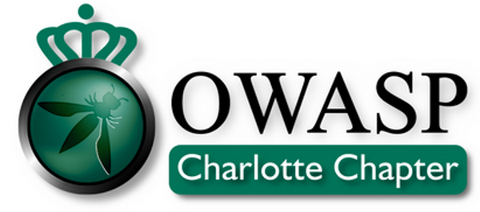

---

layout: col-sidebar
title: OWASP Charlotte
#tags: example-tag
level: 0

region: North America

meetup-group: owaspCLT
country: USA
postal-code: 28202

---

## Chapter Meetings

Started in 2010, we are the CLT area's chapter for OWASP Global. We typical meet the **4 Times a Year.** Sometimes more, we hope to also see you during the [Cyber Security Symposium](https://cybersecuritysymposium.uncc.edu/)

We hold a Meet and Greet **(Virtually During this time of COVID)** beginning at 7:00pm. Food and beverages are
provided. **(Suspended during this time of COVID, Feel free to drink and eat at your house, we for sure will be doing that!)**

Please Signup on [**Meet-Up**](https://www.meetup.com/owaspCLT) so we
can have an accurate count for food.

## Upcoming Meetings

  - [April 2021 Topic TBA!](https://www.meetup.com/owaspCLT/events/274988410/) - 04/21/21
  - [July 2021 Topic TBA!](https://www.meetup.com/owaspCLT/events/274988434/) - 07/21/21
  - [October 2021 Topic TBA!](https://www.meetup.com/owaspCLT/events/274988455/) - 10/21/21

## Local News

  - One of our projects,
    [AppSensor](https://github.com/OWASP/www-project-appsensor)
    headed by lead developer and local member [John Melton](https://github.com/jtmelton), was selected
    as a GSOC project. This is a very exciting new feature that will
    pave the way for a server/client model of AppSensor

<!-- end list -->

## Member Spotlight.

  - Jasmine M. Jackson [Fluffy007](https://thefluffy007.com/)
  - Josh Jenkins: [Huggable Hacker](https://www.huggablehacker.com/)
   - Little Felton: [Little Felton](https://www.littlefelton.com/)
<!-- end list -->

## Past Chapter Meetings

### **2018**
  - [Intro To WebApp Security with JJ -- OWASP - ZAP](https://www.meetup.com/owaspCLT/events/hhxxgpyxdbsb/)
  - [How to Burp.](https://www.meetup.com/owaspCLT/events/wnmnjpyxfbsb/)
  - [Advanced Burping](https://www.meetup.com/owaspCLT/events/wnmnjpyxgbpb/)
  - [A Night with Hyperion Gray](https://www.meetup.com/owaspCLT/events/rwpfrpyxjbrb/)
  - [MainFrame Hacking. w/ Soldier of FORTRAN](https://twitter.com/OWASPCharlotte/status/994557992984072192)
  - [A "Crash" Course in Exploiting Buffer Overflows w/Parker Garrison](https://www.meetup.com/owaspCLT/events/rwpfrpyxlblb/)
  - [Bloodhound Red and Blue](https://www.meetup.com/owaspCLT/events/rwpfrpyxnbnb/)
  - [Building an AppSec Program with a Budget of $0: Beyond the OWASP Top 10](https://www.meetup.com/owaspCLT/events/rwpfrpyxpbsb/)

### **2019**
Coming Soon! Moving from Old OWASP Wiki.

### **2020**
  - [2020 Kick Off Meeting (DA in Under 30 w/ Michael Kannan)](https://www.meetup.com/owaspCLT/events/268712712/)
    - [Agenda](assets/images/DA-Under-30(agenda).pptx) (Auto Download)
    - [Slides](assets/images/DA-Under-30.pptx) (Auto Download)
    - [Video](https://www.youtube.com/watch?v=nptwNr2AXPg) 
    
    
### **2021**
  - [2021 Kick Off Meeting (Security in a Post Covid World)](https://www.meetup.com/owaspCLT/events/274975479/) - 01/21/21
     - [Slides](assets/images/OWASPCLT_12121.pptx) (Auto Download)
     - [Video](https://youtu.be/p5s1AKOTDf4)
 
## Comms with OWASP CLT

  - All of our event notifications have been moved to our MeetUp page 
    [OWASPCLT](http://www.meetup.com/owaspCLT/). Please join if
    interested as it will get updated more frequently then this wiki
    page.
  - We have a [OWASP Charlotte Twitter
    Account](http://twitter.com/OWASPCharlotte) where we'll be posting
    news about OWASP Charlotte. 
  - Please visit our [YouTube](https://www.youtube.com/channel/UC8gUuxBL8u6PDiHFdZIgnqg) page for past meetups.
  
## Misc.
  
   - [Powerpoint Slide Deck Template](assets/images/OWASPCLT_Template.pptx)

[Category:OWASP Chapter](Category:OWASP_Chapter "wikilink")
[Category:North Carolina](Category:North_Carolina "wikilink")
